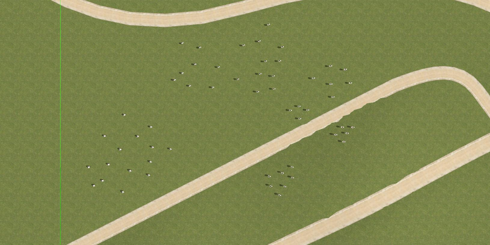
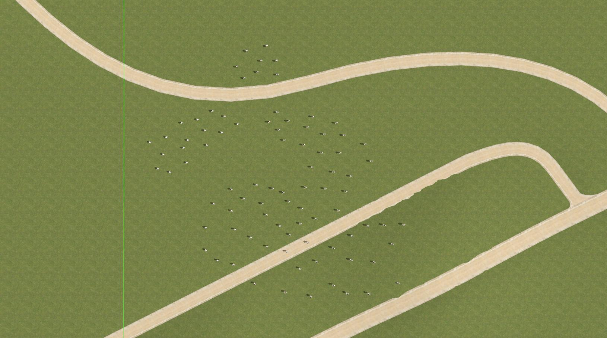
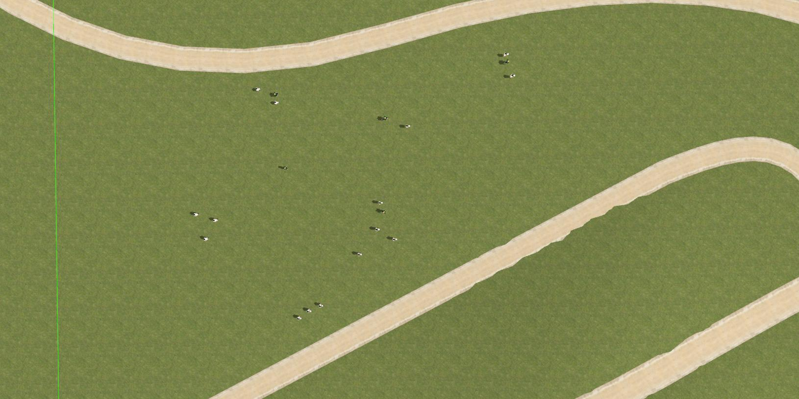

# List of Experiments in his Repository

## **Tests #0-4**
### Notes: YOLO v5 (yolov5s), Scenario: SP0, Setup #1
| **Test #** | **Success** | **Dist.** | **IoU** | **Valid Points %** |
|--------|---------|-------|------|----------------|
| 0      | True    | 17m   | 0.59 | 99.65%         |
| 1      | True    | 10m   | 0.47 | 96.46%         |
| 2      | True    | 25m   | 0.39 | 92.76%         |
| 3      | True    | 26m   | 0.12 | 78.68%         |
| 4      | True    | 8m    | 0.46 | 98.34%         |

## **Tests #5-9**
### Notes: YOLO v5 (yolov5s), Scenario: SP1, Setup #1
| **Test #** | **Success** | **Dist.** | **IoU** | **Valid Points %** |
|--------|---------|-------|------|----------------|
| 5      | False   | 1m    | 0.54 | 88.96%         |
| 6      | True    | 19m   | 0.28 | 78.96%         |
| 7      | True    | 12m   | 0.61 | 96.75%         |
| 8      | True    | 32m   | 0.13 | 73.46%         |
| 9      | True    | 11m   | 0.46 | 97.5%          |

## **Tests #10-14**
### Notes: YOLO v7, Scenario: SP1, Setup #1
| **Test #** | **Success** | **Dist.** | **IoU** | **Valid Points %** |
|--------|---------|-------|------|----------------|
| 10     | True    | 2m    | 0.71 | 96.61%         |
| 11     | True    | 3m    | 0.59 | 86.53%         |
| 12     | True    | 2m    | 0.6  | 89.55%         |
| 13     | True    | 19m   | 0.63 | 96.7%          |
| 14     | True    | 2m    | 0.75 | 98.96%         |

## **Tests #15-19**
### Notes: YOLO v7, Scenario: SP2, Setup #1
| **Test #** | **Success** | **Dist.** | **IoU** | **Valid Points %** |
|--------|---------|-------|------|----------------|
| 15     | True    | 13m   | 0.44 | 99.6%          |
| 16     | True    | 11m   | 0.43 | 99.14%         |
| 17     | True    | 15m   | 0.5  | 98.79%         |
| 18     | True    | 2m    | 0.54 | 100%           |
| 19     | True    | 3m    | 0.42 | 100%           |

## **Tests #20-24**
### Notes: YOLO v7, Scenario: SP2, Setup #2
| **Test #** | **Success** | **Dist.** | **IoU** | **Valid Points %** |
|--------|---------|-------|------|----------------|
| 20     | True    | 16m   | 0.41 | 99.06%         |
| 21     | True    | 2m    | 0.46 | 99.0%          |
| 22     | True    | 24m   | 0.42 | 100%           |
| 23     | True    | 24m   | 0.37 | 98.23%         |
| 24     | True    | 15m   | 0.4  | 97.47%         |

## **Misc. Tests #20-24**
| **Test #** | **Notes** |
|--------|---------|
| DynamicStride     | Test executed with fixed stride |
| StaticStride     | Test executed with dynamic stride |
| 25     | Test executed with YOLO v7 tiny using Nvidia Jetson Nano in the loop |

## **Scenario Images**
| Scenarios | Image |
|-----------|-------|
| **SP0**       |   |
| **SP1**       |   |
| **SP2**       |   |

## **Simulation Setups**
| Setup # | CPU                       | GPU                                            | RAM  |
|---------|---------------------------|------------------------------------------------|------|
| 1       | Intel i7-9750H            | RTX 2060                                       | 16Gb |
| 2       | Quad-core ARM  Cortex-A57 | NVIDIA Maxwell  architecture  (128 CUDA cores) | 4Gb  |
